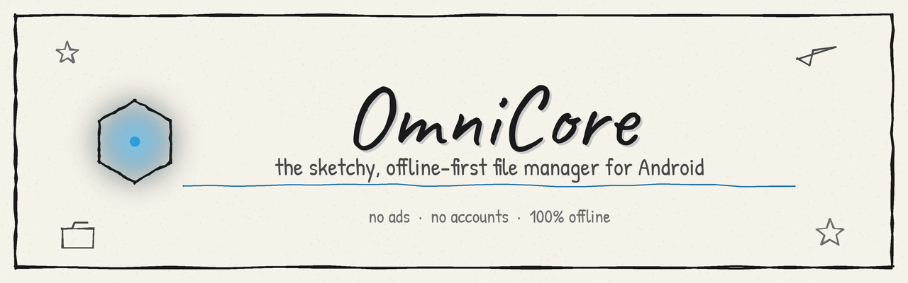
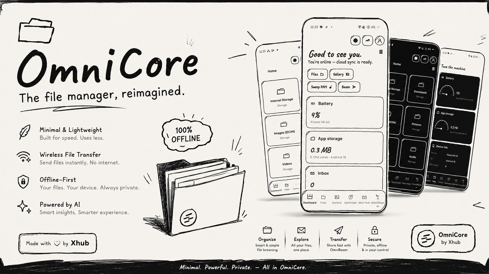
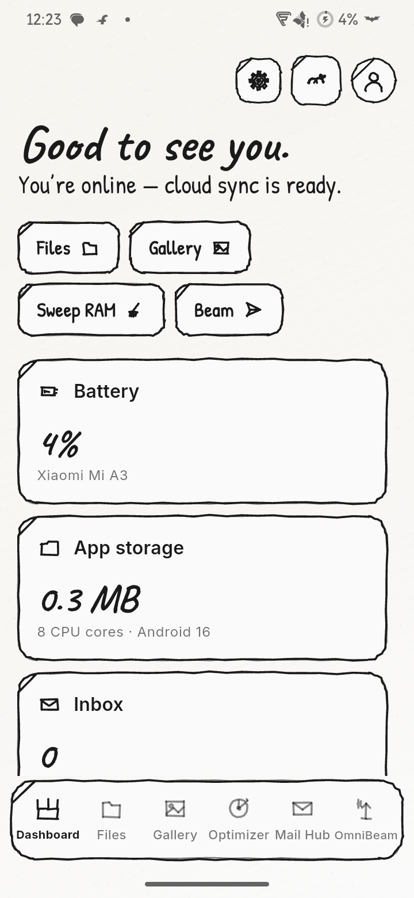
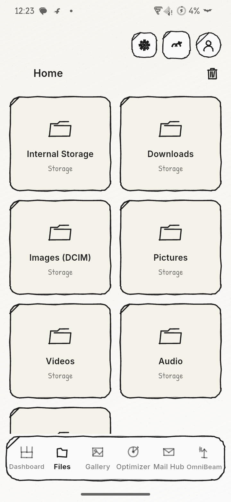
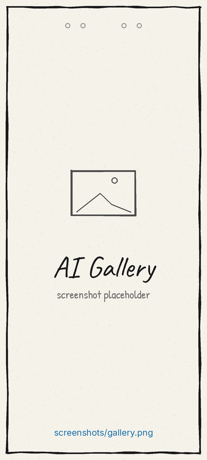
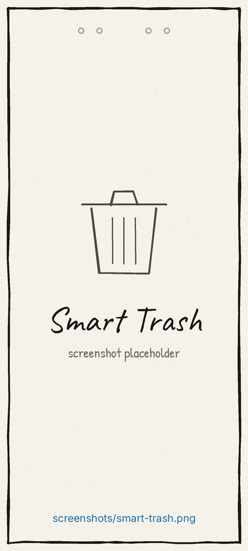
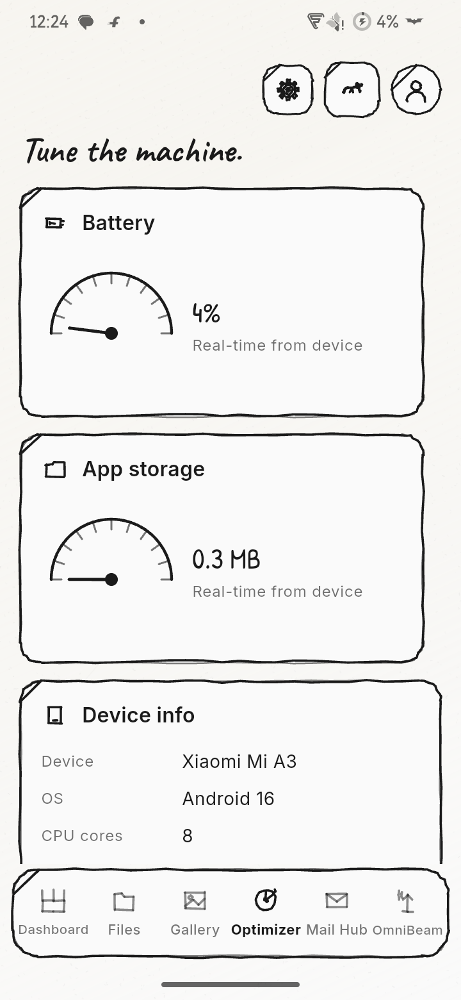
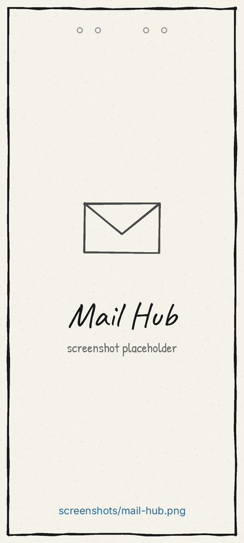
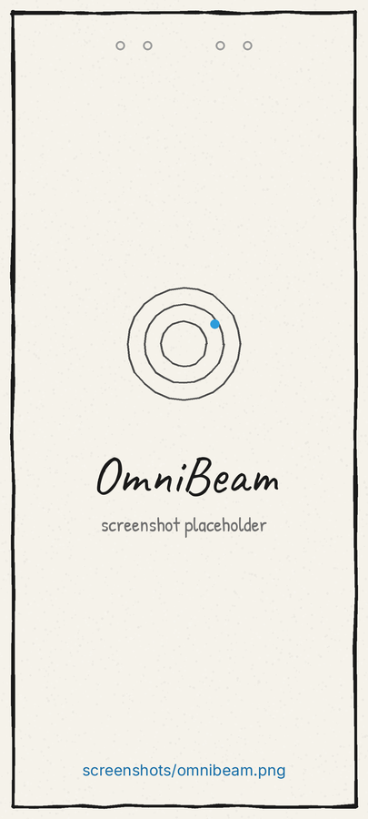

<!--
  OmniCore README
  Update OWNER/REPO in the badge URLs below (search for "ShadowByte01/OmniCore")
  once this is pushed, so the star/fork/issue counters point at your repo.
-->

<div align="center">



<br><br>


<br>


<br><br>

<p>
A minimal, no-nonsense file manager for Android — hand-sketched, ad-free, and<br>
built to work with zero internet connection and zero account required.
</p>

<p>
<b>⭐ If OmniCore looks like your kind of app, drop a star — it genuinely helps a solo project like this get seen.</b>
</p>

</div>

<br>

<p align="center">
  
  <br>
  <sub><i>↑ replace <code>poster/poster.png</code> with your own feature graphic — recommended size 1024 × 500</i></sub>
</p>

<br>

## 📸 Screenshots

<table align="center">
  <tr>
    <td align="center" width="25%"><br><sub>Dashboard</sub></td>
    <td align="center" width="25%"><br><sub>File Manager</sub></td>
    <td align="center" width="25%"><br><sub>AI Gallery</sub></td>
    <td align="center" width="25%"><br><sub>Smart Trash</sub></td>
  </tr>
  <tr>
    <td align="center" width="25%"><br><sub>Optimizer</sub></td>
    <td align="center" width="25%"><br><sub>Mail Hub</sub></td>
    <td align="center" width="25%"><br><sub>OmniBeam</sub></td>
    <td align="center" width="25%"></td>
  </tr>
</table>

<p align="center"><sub>Drop your real captures into <code>screenshots/</code> using the same filenames and they'll show up here automatically.</sub></p>

<br>

## ✨ Features

OmniCore's core is a file manager — but it ships as a small offline-first suite built around it. Everything below works with **no internet connection and no account.**

| | Feature | What it does |
| --- | --- | --- |
| 📁 | **File Manager** | Dual-pane on desktop layouts, swipe-to-go-back on mobile. Real on-device file scanning, no cloud indexing required. |
| 🗑️ | **Smart Trash** | Deleted files sit in a 30-day countdown before permanent purge, with swipe-to-restore. |
| 🖼️ | **AI Gallery** | Masonry photo grid with automatic tagging (falls back to filename/time-of-day heuristics when offline). |
| 🩹 | **Offline Photo Editor** | Crop, filter, and draw — no round trip to a server. |
| ⚡ | **Optimizer** | Live CPU/RAM/battery gauges and a one-tap cleanup sweep. |
| 📬 | **Mail Hub** | IMAP/SMTP mail with an offline outbox and automatic priority scoring. |
| 📡 | **OmniBeam** | Nearby device discovery + peer-to-peer file transfer over WebRTC/Bluetooth — no Wi-Fi network required. |
| ☁️ | **Cloud Sync** *(optional)* | Google sign-in via Supabase, entirely opt-in — the app never prompts for login. |

<br>

## 🎨 Design language — "Let's Sketch"

Every screen is rendered like it was inked on paper: hand-wobbled borders, procedural paper grain, and spring-physics animation. Strictly black, white, and graphite — with one electric-blue accent borrowed from the app's logo mark.

<p align="center">


</p>

| Element | Choice |
| --- | --- |
| **Borders** | Hand-drawn double-stroke wobble on every container (Rough.js-style), 1.5–2.2px |
| **Backgrounds** | Procedural paper-grain texture, cached for zero-lag scrolling |
| **Headings** | `Caveat` |
| **Captions** | `Patrick Hand` |
| **Body text** | `Inter` |
| **Icons** | 50+ hand-drawn doodle glyphs, drawn at runtime — no sprite atlas |
| **Motion** | Spring curves (`easeOutBack` / `fastOutSlowIn`) throughout |
| **Dark mode** | A black chalkboard with white chalk strokes, not just an inverted palette |

<br>

## 🧱 Tech stack

<p align="center">


</p>

| Layer | Choice |
| --- | --- |
| Framework | Flutter 3.27+ / Dart 3.5+ (null-safe) |
| State management | Riverpod 2.x — runtime API, no `build_runner` step |
| Local database | Drift (SQLite), runtime API |
| Cloud & auth *(optional)* | Supabase + Google Sign-In |
| P2P transfer | `flutter_webrtc` + `flutter_blue_plus` |
| On-device tagging | `tflite_flutter` |
| Mail | `enough_mail` (IMAP/SMTP) |

> No `build_runner` step required — `flutter pub get` and you're ready to build.

<br>

## 🚀 Getting started

```bash
# 1. Prerequisites — Flutter 3.27+ on your PATH
flutter --version

# 2. Scaffold the native platform folders (won't touch lib/ or pubspec.yaml)
flutter create --org com.omnicore --project-name omnicore \
  --platforms=android .

# 3. Fetch dependencies (fonts + logo are already bundled in assets/)
flutter pub get

# 4. Generate the launcher icon from assets/images/app_logo.png
dart run flutter_launcher_icons

# 5. Apply the Android config below, then build
flutter build apk --release
#  → build/app/outputs/flutter-apk/app-release.apk
```

Run it on a connected device while you work:

```bash
flutter run
```

<details>
<summary><b>📱 Required Android configuration (click to expand)</b></summary>

<br>

**`android/app/build.gradle.kts`** — `flutter_webrtc` and `tflite_flutter` need API 23+:

```kotlin
android {
    defaultConfig {
        minSdk = 23
        targetSdk = flutter.targetSdkVersion
    }
}
```

**`android/app/src/main/AndroidManifest.xml`** — add above `<application>`:

```xml
<uses-permission android:name="android.permission.INTERNET"/>
<uses-permission android:name="android.permission.ACCESS_NETWORK_STATE"/>
<uses-permission android:name="android.permission.READ_EXTERNAL_STORAGE" android:maxSdkVersion="32"/>
<uses-permission android:name="android.permission.WRITE_EXTERNAL_STORAGE" android:maxSdkVersion="29"/>
<uses-permission android:name="android.permission.READ_MEDIA_IMAGES"/>
<uses-permission android:name="android.permission.READ_MEDIA_VIDEO"/>
<uses-permission android:name="android.permission.READ_MEDIA_AUDIO"/>
<uses-permission android:name="android.permission.BLUETOOTH" android:maxSdkVersion="30"/>
<uses-permission android:name="android.permission.BLUETOOTH_ADMIN" android:maxSdkVersion="30"/>
<uses-permission android:name="android.permission.BLUETOOTH_SCAN"/>
<uses-permission android:name="android.permission.BLUETOOTH_CONNECT"/>
<uses-permission android:name="android.permission.ACCESS_FINE_LOCATION"/>
<uses-permission android:name="android.permission.ACCESS_COARSE_LOCATION"/>
<uses-permission android:name="android.permission.POST_NOTIFICATIONS"/>
<uses-permission android:name="android.permission.CHANGE_WIFI_MULTICAST_STATE"/>
```

Inside `<application ...>`:

```xml
<application
    android:label="OmniCore"
    android:usesCleartextTraffic="true">
```

**Why each permission is requested** (all asked one-by-one on first launch, via a native OS dialog — nothing is silent):

| Permission | Used for |
| --- | --- |
| Storage / Media | Real on-device file & photo scanning for the File Manager and Gallery |
| Bluetooth (scan + connect) | Discovering nearby devices for OmniBeam |
| Location | Required by Android alongside Bluetooth scanning |
| Notifications | Transfer / sync status updates |

</details>

<details>
<summary><b>☁️ Optional: cloud sync & Google Sign-In (click to expand)</b></summary>

<br>

Auth and cloud sync are **strictly opt-in** — OmniCore never prompts for login and works fully offline without them.

1. Create the schema: open your [Supabase Dashboard](https://supabase.com/dashboard) → **SQL Editor**, paste in `supabase_schema.sql` (repo root), and run it. This creates 6 tables with row-level security so each user only sees their own data.
2. Enable **Google** under **Authentication → Providers**, and add your Android **SHA-1** (`./gradlew signingReport`).
3. Build with your credentials:

```bash
flutter build apk --release \
  --dart-define=SUPABASE_URL=your_url \
  --dart-define=SUPABASE_ANON_KEY=your_anon_key \
  --dart-define=GOOGLE_SERVER_CLIENT_ID=your_web_client_id
```

Skip these defines entirely and OmniCore boots in pure local-only mode — fully functional, no login prompt anywhere.

</details>

<br>

## 🗂️ Project structure

```
lib/
├── app.dart                    # MaterialApp + theme + MainShell
├── theme/                      # "Let's Sketch" palette, fonts, spring curves
├── widgets/                    # Sketchy containers, buttons, icons, paper background
├── shells/main_shell.dart      # Responsive side-rail / bottom-nav shell
├── controllers/                # Auth, connectivity, sync
├── services/                   # OmniBeam, file indexing, AI tagging, optimizer, mail
├── database/                   # Drift (SQLite) schema, runtime API
├── models/                     # FileNode, GalleryItem, MailMessage, NearbyDevice…
└── screens/                    # Dashboard, File Manager, Gallery, Optimizer, Mail Hub, OmniBeam, Smart Trash

assets/fonts/                   # Caveat, Patrick Hand, Inter (bundled)
```

<br>

## 🗺️ Roadmap

- [ ] Wire a real signalling transport for cross-device OmniBeam (single-device transfers already work end-to-end)
- [ ] Settings sheet for managing mail accounts and AI keys from the UI
- [ ] iOS build target

<br>

## 🤝 Contributing

Issues and pull requests are welcome. If you're proposing something bigger than a small fix, open an issue first so we're aligned before you sink time into it.

```bash
git checkout -b feature/your-idea
# make your changes
git commit -m "add: your idea"
git push origin feature/your-idea
```

<br>

## 📄 License

No license file has been added to this repository yet — until one is, all rights are reserved by default. If you want others to freely use or contribute to OmniCore, consider adding a `LICENSE` file (MIT is a common, permissive choice for projects like this).

<br>

<div align="center">

## 👤 Author

**Shadow** · XHub Devs

<a href="https://github.com/ShadowByte01"></a>

<br><br>

<sub>sketched, not designed — built with 🖤 and a lot of pencil lead</sub>

</div>
